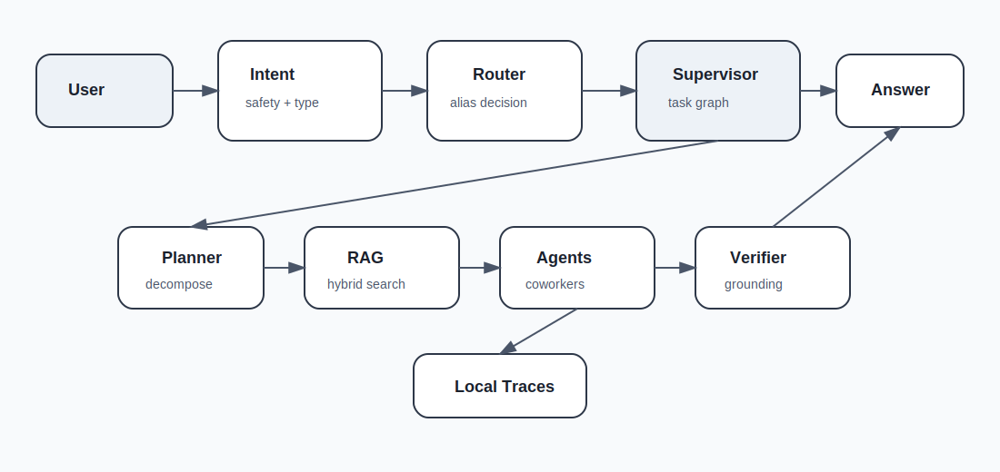
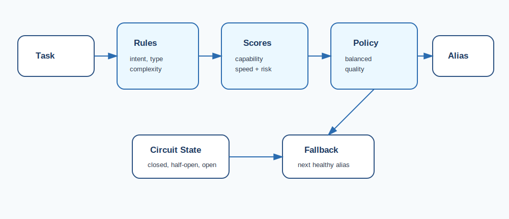
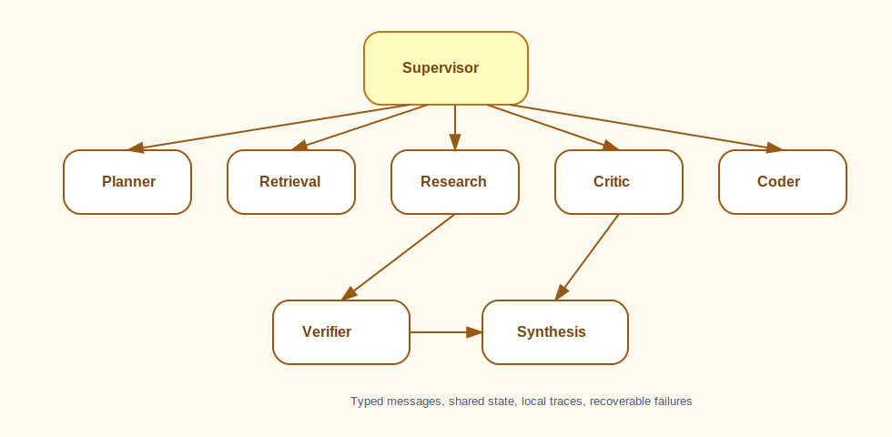
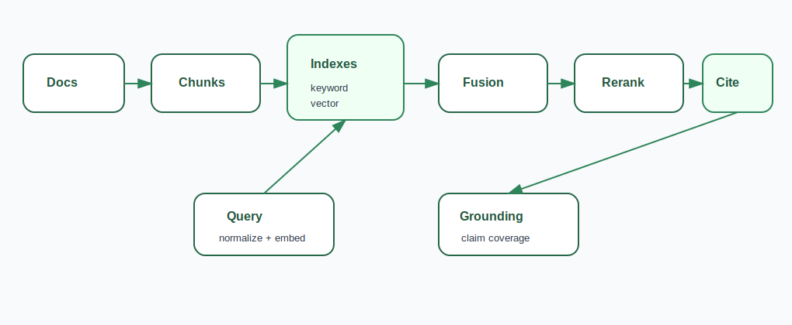
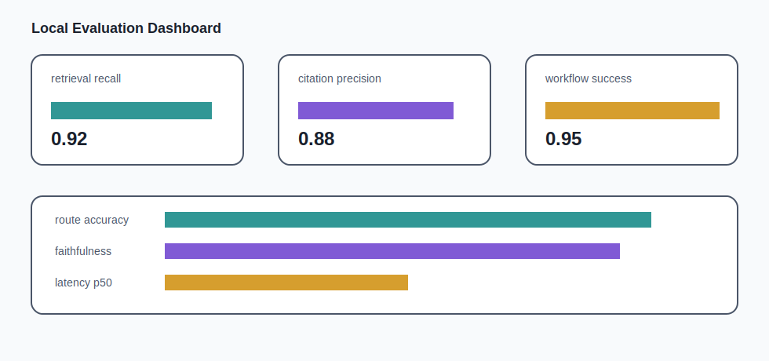

# Adaptive Multi-Agent RAG Router

**A local-first multi-agent orchestration system with dynamic model routing, retrieval, verification, and traceable reasoning.**

`local-first` `free-to-run` `no-cloud-required` `multi-agent` `RAG` `typed` `tested` `no-telemetry`



This repository is built to demonstrate a serious local AI application architecture without requiring external accounts, billing, hosted services, telemetry, or paid model access. The default path runs in deterministic mock mode, so the complete workflow is available immediately after install.

## Key Features

- Dynamic model routing across neutral model aliases.
- Supervisor-worker agent graph with typed task state.
- Hybrid retrieval using keyword search, deterministic vector search, fusion, and reranking.
- Citation-grounded answers with faithfulness checks.
- Generic local model adapters for chat, completion, embeddings, and reranking.
- Local-only observability with structured traces and a browser trace viewer.
- Evaluation suite for retrieval, citations, routes, workflows, and latency.
- Plain browser demo with chat, evidence, route, trace, and confidence panels.
- CLI and local API server for ingestion, querying, evaluation, traces, and benchmarks.

## Architecture Overview



The request path is intentionally explicit:

`User Query -> Safety and Intent Classifier -> Router -> Supervisor -> Planner -> RAG Retriever -> Coworker Agents -> Verifier -> Synthesizer -> Final Answer`

The system separates decisions from execution. Routing policies select a neutral alias, agents exchange typed messages, retrieval produces auditable evidence, and observability writes local trace files.

## Model Routing Aliases

Users map aliases to any locally available open model endpoint of their choice. The repository never requires or names a hosted service.

| Alias | Role | Typical Tasks |
| --- | --- | --- |
| reasoning_large | Deep reasoning | planning, synthesis, verification |
| coding_large | Code intelligence | code review, code generation, debugging |
| fast_small | Fast utility model | classification, routing, summaries |
| retrieval_embedder | Embeddings | document and query embeddings |
| rerank_local | Reranking | context ranking and evidence ordering |

## Quickstart

```bash
python -m venv .venv
# Activate the virtual environment with the command for your shell.
python -m pip install -e .
copy .env.example .env
python -m amarr.cli.main ingest examples/documents
python -m amarr.cli.main ask "What design principles does this knowledge base recommend for building reliable local AI systems?"
python -m amarr.cli.main serve --mock --port 8765
python scripts/run_all_tests.py
python -m amarr.cli.main evaluate
```

Mock mode is the default. It needs no downloads, no internet, and no account setup.

## Libraries And Runtime

This project is intentionally standard-library-first. It does not require external packages for runtime, tests, the API server, the CLI, the demo, retrieval, routing, evaluation, or tracing.

| Area | Libraries / Modules Used |
| --- | --- |
| CLI | `argparse`, `pathlib` |
| Local API and demo server | `http.server`, `mimetypes`, `urllib`, `json` |
| Typed architecture | `dataclasses`, `typing`, `enum`, `abc`, `collections` |
| Local persistence | `json`, `pathlib`, plain local files |
| RAG and NLP utilities | `re`, `hashlib`, `math`, `collections.Counter` |
| Model adapters | `urllib.request`, `urllib.parse`, deterministic mock adapters |
| Evaluation and tests | `unittest`, `tempfile`, `contextlib`, `io` |
| Observability | local JSON traces, HTML rendering with `html` |

External libraries: **none required**. Users can optionally connect neutral local model endpoints through the alias configuration.

## CLI Usage

```bash
python -m amarr.cli.main ingest examples/documents
python -m amarr.cli.main ask "What are the key system design principles?"
python -m amarr.cli.main evaluate
python -m amarr.cli.main trace latest
python -m amarr.cli.main serve
python -m amarr.cli.main benchmark-routing
```

## Example Output

```text
Final answer:
Reliable local AI systems should isolate local data, make model routing explicit,
retain deterministic fallbacks, verify evidence before synthesis, and keep every
trace available for inspection.

Cited sources:
- engineering_handbook.md#chunk-2
- local_knowledge_base.md#chunk-1
- research_notes.md#chunk-3

Selected route: reasoning_large
Active agents: supervisor, planner, retrieval, researcher, critic, verifier, synthesizer
Confidence score: 0.86
Retrieval evidence: 5 chunks after hybrid fusion and local reranking
Verification notes: all major claims are supported by cited evidence
```

## Agent Graph



- **Supervisor agent** owns the workflow, state transitions, and failure recovery.
- **Planner agent** decomposes the query into concrete subtasks.
- **Researcher agent** summarizes retrieved evidence and finds supporting themes.
- **Retrieval agent** calls the RAG pipeline and returns cited chunks.
- **Coding agent** handles code-oriented questions and inspection tasks.
- **Critic agent** identifies gaps, ambiguity, and weak evidence.
- **Verification agent** checks grounding, citation coverage, and confidence.
- **Synthesis agent** writes the final answer with citations and metadata.

## RAG Pipeline



Documents are loaded from local Markdown or text files, normalized, split into overlapping chunks, embedded with a deterministic fallback, and indexed in a local vector store plus keyword index. Retrieval uses reciprocal rank fusion, optional local reranking, citation formatting, and grounding checks before synthesis.

## Evaluation



The evaluation runner reports:

| Metric | Example |
| --- | ---: |
| retrieval recall | 0.92 |
| citation precision | 0.88 |
| answer faithfulness | 0.84 |
| route accuracy | 0.90 |
| workflow success | 0.95 |
| latency p50 | 42 ms |

Reports are written as JSON and Markdown under `.amarr/evals`.

## Local Privacy

- No external account is required.
- No telemetry is sent.
- Documents remain on disk in the local workspace.
- Traces remain under `.amarr/traces`.
- Model aliases are configured locally.
- Network access is disabled by default and limited to local endpoints when enabled.

## Portfolio Value

This repository demonstrates agent orchestration, retrieval architecture, model routing, local-first engineering, deterministic evaluation, structured observability, and production-quality Python design. The code is intentionally readable: each subsystem exposes small typed interfaces that can be reviewed, tested, and extended independently.

## More Visuals


